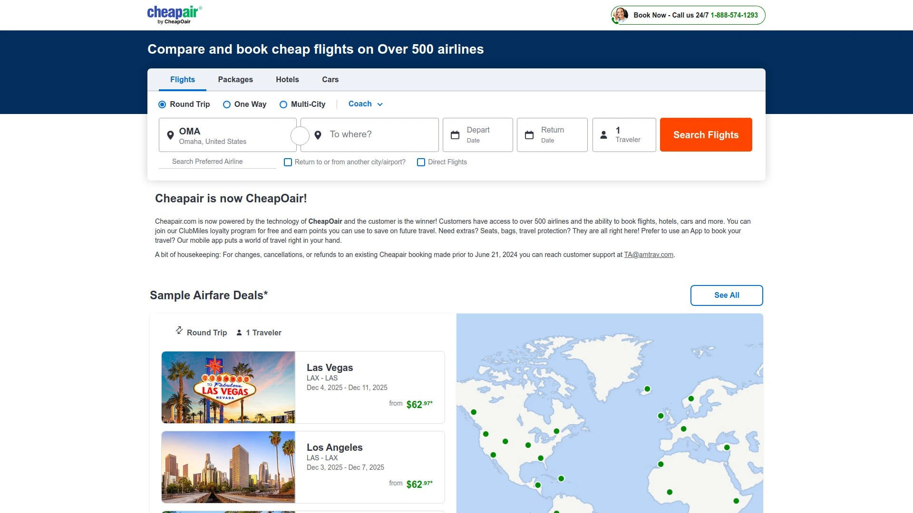
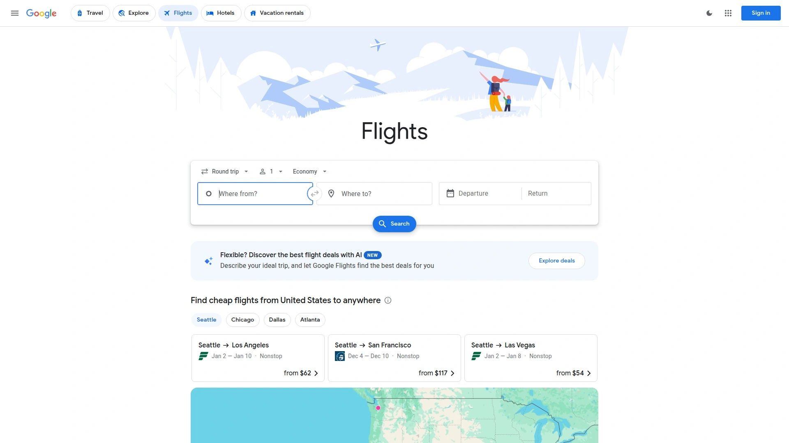
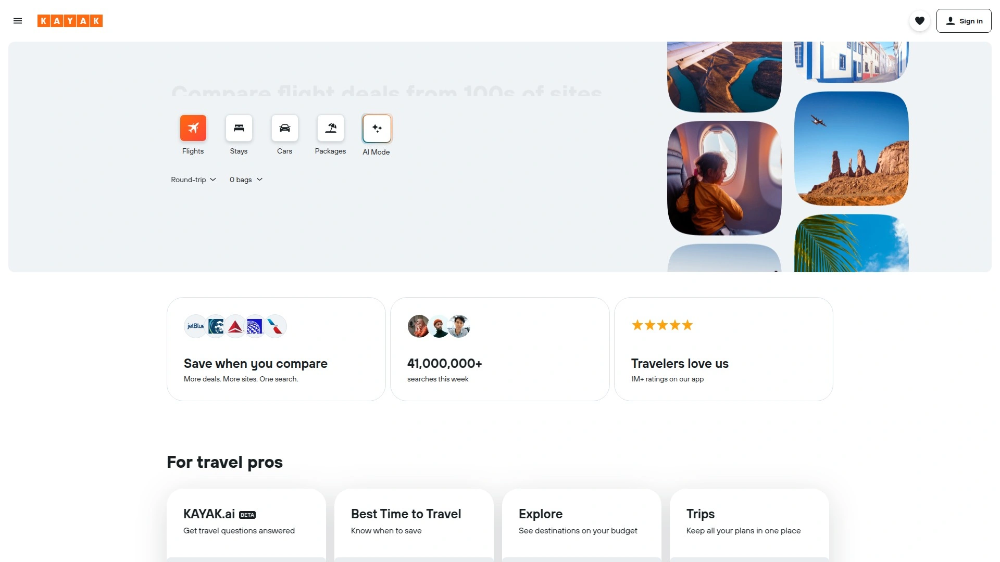
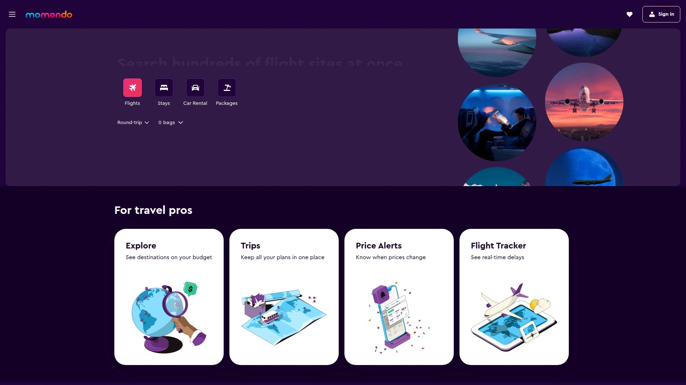
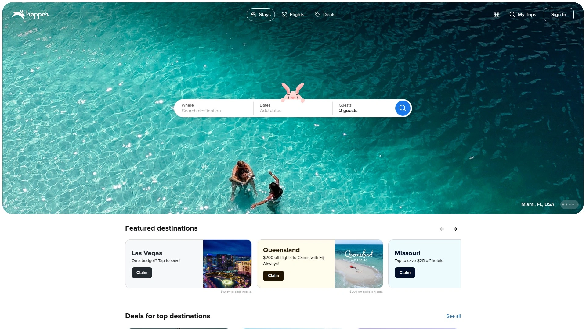
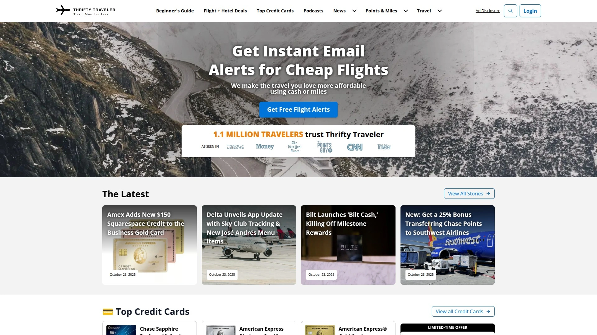
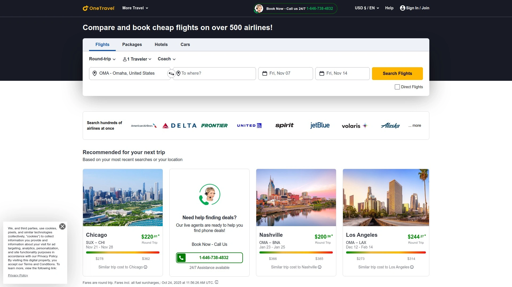

# No More Overpriced Tickets! Recommend 14 Airfare-Saving Game-Changers!

Searching airline websites individually, refreshing pages hoping prices drop, and discovering cheaper fares seconds after booking drains time and money travelers never recover. Flight booking platforms eliminate this frustration by aggregating prices across 500+ airlines simultaneously, tracking fare fluctuations with AI predictions, and alerting you instantly when mistake fares or flash sales appear—often saving $200-800 per ticket versus booking directly. The right platform balances comprehensive airline coverage with user-friendly search tools, transparent pricing without hidden fees, and features like flexible date calendars revealing cheapest travel days at a glance.

## **[CheapAir](https://cheapair.com)**

Comprehensive booking platform accessing 500+ airlines with ClubMiles loyalty rewards.

CheapAir operates through CheapOair technology providing travelers access to 500+ airlines worldwide plus hotels, rental cars, and vacation packages from unified interface. ClubMiles loyalty program lets members earn points on every booking to redeem for future travel savings without annual fees or complicated tier structures. Mobile app puts complete travel booking capabilities directly in your hand enabling searches, comparisons, and reservations anywhere.

Extras like seat selection, baggage additions, and travel protection integrate seamlessly during checkout rather than forcing separate purchases through airline websites. Flexible search tools help identify cheapest travel dates through visual calendars showing price variations across entire months. Customer support handles changes, cancellations, and refunds for bookings made through the platform.

**Consolidated booking** saves time versus visiting individual airline sites, particularly valuable when comparing multiple carriers on complex multi-city itineraries. Price alerts notify you when fares drop on routes you're watching. The platform particularly benefits frequent travelers who accumulate loyalty points across various airlines and hotel chains.

User-friendly interface welcomes first-time bookers while providing advanced filters for experienced travelers wanting granular control. CheapAir excels for travelers prioritizing convenience and rewards over spending hours manually comparing airline websites.

## **[Skyscanner](https://www.skyscanner.com)**

Leading metasearch engine scanning 1,200+ airlines with "Everywhere" discovery tool.

Skyscanner dominates comprehensive search by querying 1,200+ airlines and booking platforms including budget carriers competitors miss like Ryanair and regional alternatives. "Everywhere" search feature discovers deals to unexpected destinations when you're flexible about where to go but know when you want to travel. Enhanced AI price prediction achieves 85% accuracy forecasting whether current fares will rise or fall.

Lightning-fast search delivers results in under 3 seconds even when scanning hundreds of airlines simultaneously. Comprehensive filtering options narrow results by stops, departure times, airlines, and baggage policies. Mobile app works offline storing searches and price alerts even without internet connectivity.

**Reliability score** of 94/100 based on real bookings validates consistent performance. Average savings of $340 per international flight versus direct airline booking demonstrates substantial value. Transparent pricing shows final costs upfront without surprise fees at checkout.

Skyscanner particularly benefits flexible travelers open to discovering affordable destinations they hadn't considered. The platform excels for comprehensive initial research though users typically click through to airlines or OTAs to complete bookings.

## **[Google Flights](https://www.google.com/travel/flights)**

Lightning-fast search with superior flexible date calendar and price tracking.

Google Flights achieves instant search results faster than any competitor while maintaining comprehensive airline coverage across 800+ carriers. Flexible date calendar displays entire month's prices in color-coded grid making it trivially easy to spot cheapest travel days. Price tracking with 85% accuracy predicts whether current fares will increase or decrease, helping you decide whether to book now or wait.

Carbon footprint tracking displays environmental impact of each flight option helping eco-conscious travelers make informed decisions. Explore destinations feature shows where you can fly within your budget when dates and destination remain flexible. Integration with Google account syncs searches across devices.

**User interface** sets industry standard for intuitive design with zero learning curve required. Advanced filters refine results by alliance, layover duration, and even specific aircraft type. Average savings of $280 per flight through superior date flexibility.

Google Flights particularly benefits travelers with flexible schedules who can adjust dates by a few days to capture significant savings. The platform excels for initial research and price monitoring though redirects to airline or OTA websites for actual booking.

## **[Kayak](https://www.kayak.com)**

Feature-rich metasearch with "Hacker Fares" combining one-way tickets for savings.

Kayak pioneered metasearch travel combining 700+ airlines plus trains and buses into comprehensive journey options. "Hacker Fares" combine two one-way tickets usually on different airlines creating single itineraries often $100-300 cheaper than roundtrip bookings. PriceCheck tool uploads itinerary screenshots comparing prices across hundreds of sites ensuring you're getting best deals.

Ask Kayak AI personalizes travel planning through natural language conversations understanding context beyond simple searches. Price alerts track fare changes on routes you specify sending notifications when prices drop to your target levels. Flexible search tools excel when travel plans remain open.

**Multi-modal search** includes ground transportation options not just flights, valuable for travelers considering train or bus alternatives. Average savings of $220 per flight with particular strength in last-minute bookings. Reliability score of 87/100 validates consistent performance.

Kayak particularly benefits travelers with very flexible plans who value tools helping discover deals rather than searching specific flights. The platform excels for complex itineraries where unconventional routing saves money.

## **[Momondo](https://www.momondo.com)**

Budget champion consistently delivering 10-15% cheaper prices than competitors.

Momondo searches 1,000+ airlines and travel sites producing consistently lower prices averaging 12% below competitors. Enhanced error fare detection identifies mistake fares airlines accidentally publish before correcting them. Excellent European coverage makes it particularly valuable for transatlantic and intra-Europe bookings.

Visual search results use intuitive design showing price patterns across dates and airlines at a glance. Trip finder feature helps discover affordable destinations within your budget when you're flexible about where to go. Direct booking links send you straight to airlines or OTAs with lowest confirmed prices.

**Reliability score** of 89/100 combined with budget-champion status makes it essential for price-conscious travelers. Average savings of $290 per flight particularly on international routes. Transparent pricing displays total costs including all fees before clicking through.

Momondo particularly benefits budget travelers refusing to overpay and willing to be flexible on times and dates for maximum savings. The platform excels for European destinations and long-haul international flights.

## **[Expedia](https://www.expedia.com)**

Full-service OTA with package discounts and comprehensive booking management.

Expedia operates as complete travel agency booking flights, hotels, rental cars, and vacation packages often with discounts when bundling. Rewards program lets members earn points across all travel categories redeemable for future bookings. Comprehensive booking management handles changes and cancellations through single interface.

24/7 customer service provides human support when travel disruptions occur. Clear display of flexible change policies and fee structures helps travelers understand costs upfront. Icons show amenities like in-flight WiFi and power outlets on each flight.

**Package deals** deliver genuine savings when booking flights plus hotels simultaneously versus separate purchases. Mobile app enables complete travel management from anywhere. Established reputation as global leader provides confidence for hesitant bookers.

Expedia particularly benefits travelers planning complete trips wanting one-stop booking and support. The platform excels for vacation packages and situations where human customer service matters.

## **[Priceline](https://www.priceline.com)**

Express Deals and color-coded calendar simplifying cheap fare discovery.

Priceline operates as full-featured OTA with Express Deals offering discounts on opaque bookings where some flight details remain hidden until purchase. Color-coded calendar visualizes cheapest travel days at a glance eliminating tedious date-by-date searching. Price Match Guarantee refunds price differences if you find identical flights cheaper elsewhere.

Free online cancellation within 24 hours of booking provides safety net for hasty decisions except on Express Deal flights. Search results clearly highlight nonstop options and no-change-fee flights. Easy-to-navigate interface simplifies finding affordable flights.

**Express Deals** can offer significant discounts for flexible travelers though occasionally cost more than standard bookings. Established reputation as major OTA provides booking confidence. The platform particularly benefits travelers with flexible schedules willing to accept hidden details for savings.

Priceline excels for discovering cheap flights when specific times and carriers matter less than price.

## **[Hopper](https://hopper.com)**

Predictive AI booking app trusted by 120 million travelers worldwide.

Hopper leverages AI predicting optimal booking times with high accuracy based on billions of historical price points. Color-coded predictions show whether to book now or wait with confidence scores. Price freeze feature locks in current fares for small fee allowing you to delay purchase without price increase risk.

Comprehensive booking options span flights, hotels, car rentals, and vacation homes. Mobile-first design optimizes entire experience for smartphone booking. Price tracking alerts notify you when watched routes hit target prices.

**120 million travelers** trust Hopper's recommendations validating predictive accuracy. Average savings through optimal booking timing reduce costs without compromising travel dates. The platform particularly benefits travelers booking weeks or months ahead when prediction algorithms work best.

Hopper excels for users wanting AI guidance on when to book rather than where to go.

## **[Going](https://www.going.com)**

Premium flight deal alerts delivering $550 average savings through mistake fares.

Going employs professional deal finders scanning for error fares, flash sales, and hidden deals human searches miss. Premium membership delivers average savings of $550 on international economy, $200 on domestic, and up to $2,000 on business class. Five-star Facebook rating with 3,000+ reviews validates member satisfaction.

Diverse deal selection prevents repetitive cheap destinations ensuring variety in travel opportunities. Email and SMS alerts notify you instantly when deals appear from your selected airports. Direct airline booking links send you to carriers for purchase avoiding OTA complications.

**Professional deal team** works full-time finding opportunities casual searchers never discover. Premium plan starting at $49 annually pays for itself with single international booking. The platform particularly benefits flexible travelers who can jump on unexpected deals.

Going excels for discovery-oriented travel where destination flexibility enables capturing mistake fares.

## **[Thrifty Traveler](https://thriftytraveler.com)**

Premium alerts covering both cash fares and points/miles award availability.

Thrifty Traveler Premium delivers comprehensive deal alerts spanning cash flights and award seat availability for points redemptions. Professional flight analysts walk through each deal explaining how to book and maximize value. Heat scale indicates deal urgency helping members prioritize which offers to pursue.

Best availability indicators show optimal travel windows typically 4-10+ months advance. Thrifty tips include booking strategies and destination recommendations enhancing deal value. Both economy and premium cabin deals ensure all traveler types benefit.

**Dual focus** on cash and points makes it valuable for both traditional bookers and frequent flyer enthusiasts. Premium membership around $99 annually targets serious travelers. The platform particularly benefits planners comfortable booking far in advance.

Thrifty Traveler excels for maximizing both cash and points travel opportunities.

## **[Dollar Flight Club](https://www.dollarflightclub.com)**

Subscription deal alerts from selected airports with business class options.

Dollar Flight Club automates deal discovery sending email and SMS alerts for discounted flights from your chosen departure airports. Premium membership ($69 annually) provides 5x more deals including mistake fares and secret fares from up to four airports. Premium Plus ($99 annually) adds business and first class deals valuable for premium cabin flyers.

Mobile app delivers convenient deal browsing and booking on the go. Free plan provides limited deals from single airport for testing service. Two-week free trial for $1 lets you evaluate premium features before committing.

**Million+ subscribers** validate service popularity. Deals typically show round-trip fares, standard prices, savings amounts, and multiple travel dates. The platform particularly benefits frequent flyers wanting automated deal discovery.

Dollar Flight Club excels for travelers preferring alerts over manual searching.

## **[Secret Flying](https://www.secretflying.com)**

Free deal blog publishing mistake fares and flash sales globally.

Secret Flying operates as free blog publishing flight deals as they're discovered without subscription fees. Focus on significant discounts means deals published represent genuine savings opportunities. International scope covers deals from airports worldwide.

Mistake fare specialization finds pricing errors airlines accidentally publish. Flash sale coverage alerts travelers to limited-time airline promotions. Social media presence enables real-time deal sharing.

**Free access** removes financial barriers making premium deals available to everyone. Rigid deal standards ensure quality though may miss smaller savings opportunities. The platform particularly benefits flexible travelers who can act quickly when deals appear.

Secret Flying excels for budget-conscious travelers wanting free deal alerts.

## **[Travelocity](https://www.travelocity.com)**

Full-service OTA with Price Match Guarantee and flexible cancellation policies.

Travelocity provides comprehensive booking for flights, hotels, car rentals, and vacation packages backed by Expedia technology. Price Match Guarantee protects against overpaying. Wander Wisely program emphasizes flexible booking with free changes and cancellations on select bookings.

Clear search results and user-friendly interface simplify finding affordable flights. Same features as Expedia and Orbitz due to shared ownership though occasional price variations exist. Standard filters include stops, airlines, times, and nearby airports.

**Established brand** dating back to early internet travel booking provides booking confidence. The platform particularly benefits travelers wanting traditional full-service OTA experience. Travelocity excels for complete vacation planning beyond just flights.

## **[Orbitz](https://www.orbitz.com)**

Rewards-focused OTA delivering "Orbucks" on every booking.

Orbitz offers comprehensive flight booking with Orbitz Rewards program earning "Orbucks" on purchases redeemable for future travel. Same technology and features as Expedia and Travelocity due to shared ownership. Clear display of flexible policies and amenity icons.

Flexible date matrix helps identify cheapest travel days. Standard OTA filters and sorting options. Mobile app and website deliver consistent experience.

**Rewards focus** differentiates Orbitz for travelers wanting earning potential on every booking. The platform particularly benefits frequent bookers accumulating rewards. Orbitz excels for travelers already invested in Expedia Group ecosystem.

## **[OneTravel](https://www.onetravel.com)**

Budget-focused OTA delivering deals on flights and vacation packages.

OneTravel specializes in finding affordable airline tickets and vacation package deals. Comprehensive search across thousands of destinations worldwide. Straightforward booking process focused on price-conscious travelers.

Search tools help identify cheap flights to favorite destinations. Vacation package bundling delivers savings on combined bookings. Mobile-optimized site enables booking from anywhere.

**Budget positioning** attracts price-conscious travelers prioritizing savings over premium features. Smaller OTA status means less brand recognition than industry giants. The platform particularly benefits travelers focused purely on finding lowest fares.

OneTravel excels for straightforward budget bookings without needing advanced features.

## FAQ

**Should I book flights directly with airlines or through booking platforms?**
Booking directly with airlines typically provides better customer service for changes, cancellations, and irregular operations like delays, plus loyalty program benefits and often better seat selection. However, booking platforms frequently offer lower prices, especially on OTA "secret fares" and by comparing 500+ airlines simultaneously finding routes you'd never discover manually. Best practice: use platforms to find cheapest options, then check airline direct pricing—if prices match or differ by under $20, book direct for superior service.

**When is the best time to book flights for lowest prices?**
Book domestic flights approximately 28 days before departure and international flights 60 days before for optimal pricing, though this varies by route and season. Tuesday and Wednesday departures typically cost less than Friday through Monday travel. Set price alerts on platforms like Google Flights or Hopper 2-3 months before your trip to track fare trends rather than guessing optimal booking moment. Last-minute deals still exist though relying on them risks sold-out flights or premium pricing.

**Are flight deal alert services like Going and Dollar Flight Club worth the cost?**
Premium deal services save $200-800 on average per international booking through mistake fares and flash sales casual searchers miss, paying for annual subscriptions ($49-99) with single trip. However, they require flexibility on dates, destinations, and sometimes departure times since deals appear spontaneously rather than matching predetermined plans. Best for travelers who book 2+ international trips annually and can adjust plans around deals rather than rigid schedules.

## Find Your Next Flight Without Overpaying

Flight booking platforms eliminate tedious manual airline searches by aggregating prices across 500+ carriers simultaneously, tracking fares with AI predictions, and alerting you to mistake fares saving $200-800 per ticket versus booking blindly. [CheapAir](https://cheapair.com) excels for travelers wanting comprehensive access to 500+ airlines plus hotels and cars from unified platform, earning ClubMiles loyalty points on every purchase, and managing complete trips through convenient mobile app without juggling multiple websites. Choose platforms matching your priorities whether AI price predictions, deal alerts, or full-service booking, then stop overpaying for flights you could've found cheaper with five minutes of smart searching.
